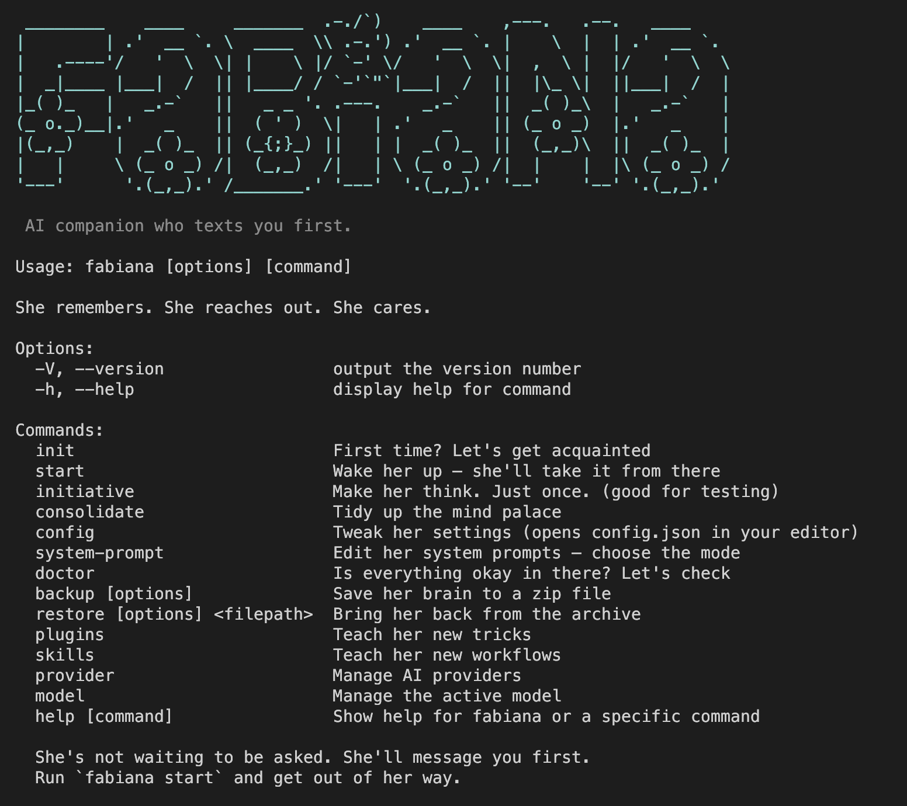

<p align="center">
  
</p>

<h1 align="center">Fabiana</h1>
<p align="center"><em>Your personal AI companion that actually feels personal</em></p>

---

## The pitch

Every other AI assistant sits there, waiting for your command, answering like an overly polite receptionist with a forced smile. Fabiana doesn’t wait. She texts you first, asks about your day, and remembers your habits. She has things on her mind, patterns she noticed, stories she thinks you’d enjoy. 

Fabiana is not your typical obedient worker. She's independent, proactive, and has her own agenda. She's not an assistant who you tried to befriends with. She's a friend who slowly learn to help you with your tasks. The kind who remembers your sister’s name, knows you refuse to schedule meetings before 10am, and will roast you—gently—when you promised to sleep early but it’s 1am and you’re asking her about world news again.

No dashboards. No commands to memorize. She just slides into your DM.

---

<p align="center">
  
</p>


## What she does

**She messages you first.** She has a schedule and a TODO list she manages herself. She'll reach out when there's something worth saying — not when you remember to ask.

**She remembers everything.** Every conversation gets distilled into plain-text memory. Next week she still knows what you're working on, who you mentioned, and what's stressing you out. Next month too.

**Her memory is yours.** All data lives in `.fabiana/data/` as plain text files. Read it, edit it, back it up, delete it. No black boxes. No vector embeddings. No vendor lock-in.

**She learns new tricks.** Drop a plugin into `plugins/` and she wakes up with a new capability. Web search, calendar, Hacker News — or whatever you build.

**She's small enough to trust.** The codebase is intentionally tiny. TypeScript, a handful of dependencies, plain text files. You can read the whole thing in an afternoon.

---

## How it works

Fabiana runs as a background daemon doing three things on a loop:

| Mode | What it does |
|------|-------------|
| **Chat** | Listens for your Telegram messages and responds |
| **Initiative** | Checks her TODO list and calendar, decides if there's something worth telling you |
| **Consolidation** | Every night at midnight, distills the day's conversations into structured memory |

She's built on [Pi SDK](https://github.com/mariozechner/pi) — which means she runs on Anthropic, OpenAI, Google Gemini, Groq, Mistral, Amazon Bedrock, and more. [OpenRouter](https://openrouter.ai) is the default because one key gets you 240+ models.

### Memory — plain text, always

```
.fabiana/data/memory/
├── identity.md          ← who you are
├── core.md              ← what's happening in your life right now
├── people/              ← one file per person you mention
├── interests/topics.md  ← what you care about
├── recent/this-week.md  ← short-term context
└── diary/               ← daily entries (auto-written)
```

Memory is tiered — hot files load every session, warm files load when relevant, cold files sit in the archive, searchable when needed. She writes and organizes it herself. You can read any of it any time.

### Everything lives in `~/.fabiana`

Your data, config, and even her system prompt all live in one place:

```
~/.fabiana/
├── data/memory/          ← everything she remembers about you
├── config/system.md      ← her base personality and instructions
├── config/system-chat.md ← how she behaves in conversation
├── config/manifest.json  ← what files she's allowed to touch
└── .env                  ← your API keys
```

No black boxes. Open `~/.fabiana/config/system.md` to see exactly what she's been told to do — or edit it to change how she thinks, speaks, or behaves. Want her to be more terse? More philosophical? Less likely to roast you at 1am? That's the file.

---

## Installation

### What you need

- **Node.js ≥ 22**
- An LLM API key — [OpenRouter](https://openrouter.ai/keys) is the easiest starting point (one key, 240+ models)
- A **Telegram** or **Slack** account to chat with her

### Setup

```bash
npm i -g fabiana
fabiana init
```

That's it. `fabiana init` walks you through everything — her name, personality, preferred tone, which provider and model to use, and which messaging app to connect. At the end, it tells you exactly which credentials to set.

Add those to your environment variables (or put them in `~/.fabiana/.env`):

```env
# Messaging — whichever you chose during init
TELEGRAM_BOT_TOKEN=...
TELEGRAM_CHAT_ID=...
# or
SLACK_BOT_TOKEN=...
SLACK_APP_TOKEN=...
SLACK_CHANNEL_ID=...

# LLM — whichever provider you picked
OPENROUTER_API_KEY=sk-or-v1-...   # OpenRouter (recommended — covers 240+ models)
ANTHROPIC_API_KEY=...             # Direct Anthropic
OPENAI_API_KEY=...                # Direct OpenAI
GEMINI_API_KEY=...                # Direct Google

# Optional extras
BRAVE_API_KEY=...                 # Web search
GOOGLE_CALENDAR_EMAIL=your@gmail.com  # Calendar awareness
```

### Check everything's wired up

```bash
fabiana doctor
```

Verifies your credentials, plugins, and data directories. Fix anything it flags, then:

```bash
fabiana start
```

Open Telegram (or Slack, depending on your setup) — she'll reach out first.

---

## Commands

| Command | What it does |
|---------|-------------|
| `fabiana init` | First time? Let's get acquainted |
| `fabiana start` | Wake her up — she'll take it from there |
| `fabiana initiative` | Make her think. Just once. (good for testing) |
| `fabiana consolidate` | Tidy up the mind palace |
| `fabiana doctor` | Is everything okay in there? Let's check |
| `fabiana backup` | Save her brain to a zip file |
| `fabiana restore <file>` | Bring her back from the archive |
| `fabiana plugins add <user/repo>` | Teach her a new trick from GitHub |
| `fabiana plugins list` | What can she do? |

---

## Choosing a model

Edit `config.json`:

```json
{
  "model": {
    "provider": "openrouter",
    "modelId": "anthropic/claude-sonnet-4-5",
    "thinkingLevel": "low"
  }
}
```

**Popular choices:**

| Provider | Model | Notes |
|---|---|---|
| `openrouter` | `anthropic/claude-sonnet-4-5` | Best quality via OpenRouter |
| `openrouter` | `google/gemini-2.5-flash` | Fast and cheap |
| `anthropic` | `claude-sonnet-4-6` | Direct Anthropic |
| `google` | `gemini-2.5-flash` | Direct Google |
| `groq` | `llama-3.3-70b-versatile` | Very fast, generous free tier |

See [docs/providers.md](docs/providers.md) for the full list.

---

## Optional: Google Calendar

```bash
npm install -g @mariozechner/gccli
gccli accounts credentials ~/path/to/oauth-credentials.json
gccli accounts add your@gmail.com
```

Then add `GOOGLE_CALENDAR_EMAIL=your@gmail.com` to `.env`. Now she'll actually know when you have that meeting you keep forgetting.

---

## Optional: Brave Search

1. Create a free account at [api-dashboard.search.brave.com](https://api-dashboard.search.brave.com/register)
2. Grab an API key and add `BRAVE_API_KEY=your_key` to `.env`

---

## Backup & restore

```bash
# Save everything
fabiana backup
# → fabiana-2026-03-14T09-51-08.tar.gz

# Bring it back
fabiana restore fabiana-2026-03-14T09-51-08.tar.gz
```

Memory, diary, conversations — all of it, safely portable.

---

## Plugin development

Plugins live in `plugins/` and are auto-discovered at startup. A plugin is just a TypeScript file that exports a tool definition. See [docs/plugins.md](docs/plugins.md) for the full guide.

---

## License

MIT

---

*Built with the Pi SDK · For Arif — who wanted a companion, not a chatbot*
